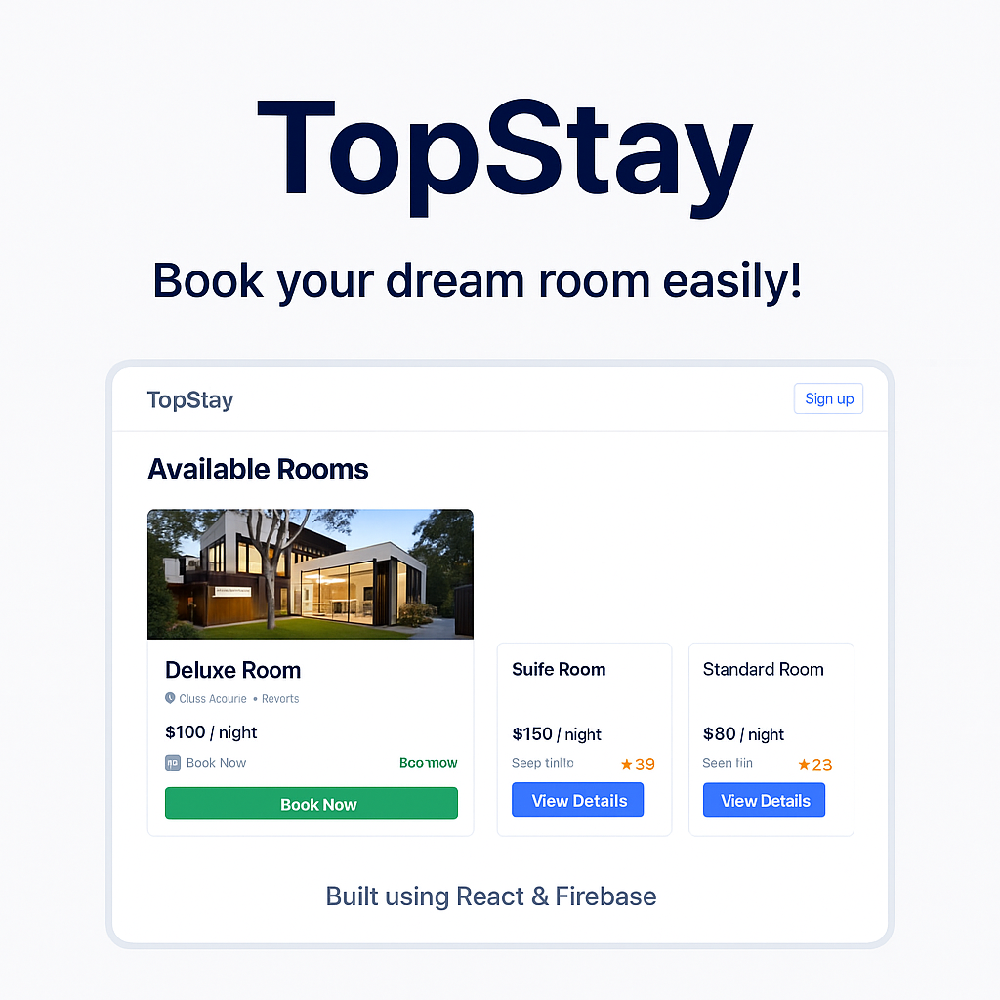

# 🏨 TopStay – Hotel Booking App

A full-stack hotel booking web application built with **React** and **Firebase**, offering a seamless experience for users to browse, view details, and book rooms. This project is designed with modern UI and supports both **dark** and **light** themes.

---

## 📸 Screenshots

| Light Mode | Dark Mode |
|------------|-----------|
|  |  |

---

## 🔧 Features

- 🌐 Full SPA with React + React Router
- 🔐 Firebase Authentication (Sign Up / Login)
- 🛏️ Room listing with dynamic routing
- 🧾 Room Details + Booking Form
- 📦 Firestore to store bookings
- 🌙 Dark / Light mode switch
- ✅ Booking validation & user-based storage

---

## 🛠️ Tech Stack

- **Frontend:**
  - React
  - Tailwind CSS
  - React Router DOM

- **Backend (Firebase):**
  - Firebase Auth
  - Firestore Database

---

## 📁 Folder Structure

---

## 🧪 How to Run Locally

```bash
git clone https://github.com/Suhaib-Zaid/hotel-booking-app.git
cd hotel-booking-app
npm install
npm start


## 🚀 Future Enhancements

- User Booking Dashboard
- Cancel Booking Feature
- Admin Panel for Hotel Management
- Filters by Price, Rating, Hotel
- Stripe Payment (Fake or Real)


---

## 👤 Author

Developed by **Suhaib Zaid**  
[GitHub Profile](https://github.com/Suhaib-Zaid)
